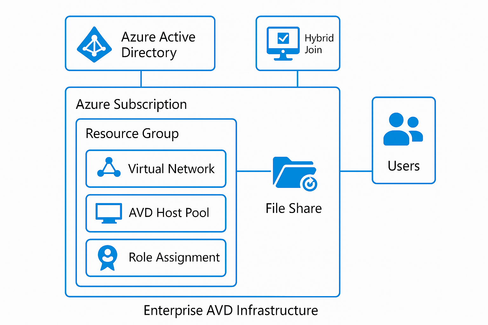

# Enterprise Azure Virtual Desktop (AVD) Landing Zone

This project automates a complete enterprise-ready Azure Virtual Desktop (AVD) environment using Terraform. Designed to support Hybrid Join, FSLogix profiles, and role-based access control.

## Architecture



## What It Deploys

- 🔹 Virtual Network with 3 subnets
- 🔹 Azure Virtual Desktop Host Pool (pooled mode)
- 🔹 Windows 11 Multi-session session hosts
- 🔹 FSLogix profile containers via Azure Files
- 🔹 Hybrid Join configuration
- 🔹 RBAC for AVD admins and users

## Modules

| Module   | Description                              |
|----------|------------------------------------------|
| `network` | Deploys VNet + 3 subnets                |
| `identity` | Hybrid join via AD DS or Azure AD DS   |
| `avd`     | Host pool + session hosts + app group   |
| `storage` | Azure Files for FSLogix profile storage |
| `rbac`    | Role assignments for users/admins       |

## Getting Started

1. Set Azure credentials using environment variables or Azure CLI
2. Clone the repo
3. Fill in values in `terraform.tfvars` or define them in CLI
4. Run:

```bash
terraform init
terraform plan
terraform apply


⚙️ Prerequisites
Azure Subscription (with Contributor rights)

Azure CLI installed and authenticated

Terraform 1.5+ installed

(Optional) Azure AD Domain Services or On-Prem Hybrid AD

🧪 Testing & Validation (What Happens After Apply)
Once deployed, this configuration will:

Provision a VNet with subnets for session hosts, domain join, and management

Join Windows 11 multi-session hosts to your Active Directory

Deploy a Pooled AVD Host Pool with a Desktop App Group

Set up FSLogix user profile redirection to Azure Files

Assign RBAC roles:

Contributor to IT Admin

Desktop Virtualization User to regular users

